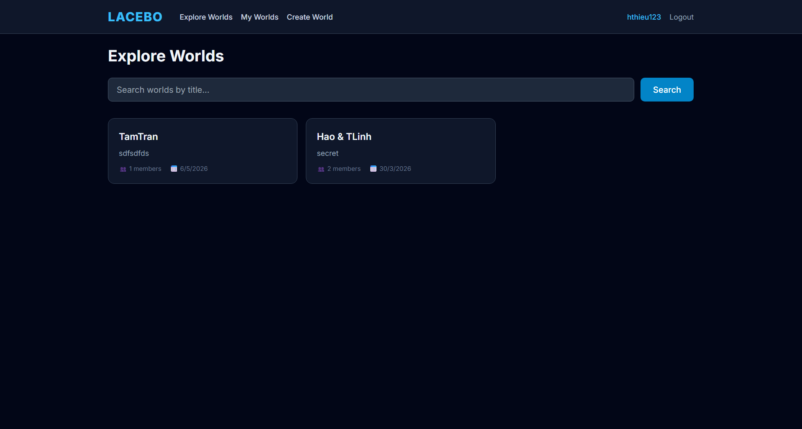
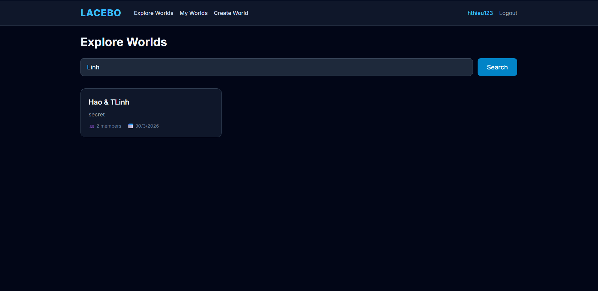
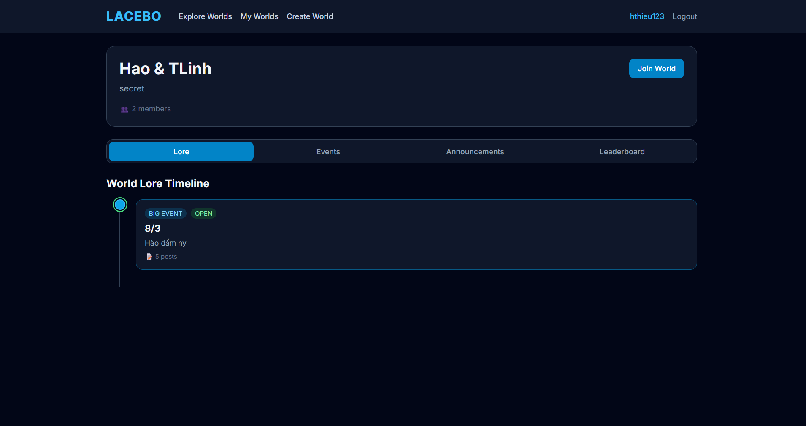
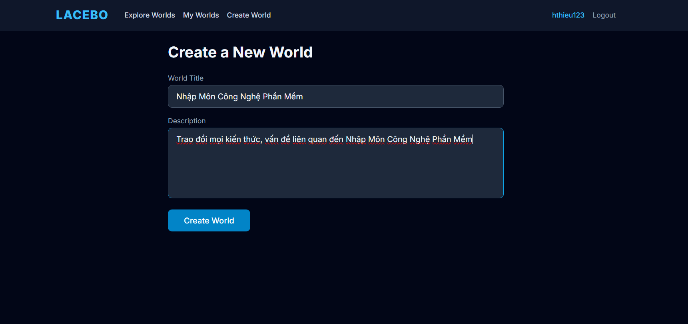

# Hướng dẫn sử dụng các tính năng World của LACEBO

Tài liệu này mô tả cách người dùng thao tác với nhóm tính năng World của dự án LACEBO. 

## 1. Mục tiêu

Sau khi đọc hướng dẫn này, người dùng có thể:

- Duyệt và tìm kiếm các world theo tiêu đề.
- Tạo một world mới với tiêu đề và mô tả.
- Gửi yêu cầu tham gia world và kiểm tra trạng thái thành viên.
- Xem danh sách world đã tham gia, vai trò hiện tại và số credits tích lũy.
- Truy cập bảng xếp hạng Top 50 trong trang chi tiết world.

## 2. Duyệt và tìm kiếm world

### 2.1. Cách xem danh sách world

1. Sau khi đăng nhập, mở trang **Explore Worlds**.
2. Hệ thống hiển thị danh sách world hiện có.
3. Mỗi world thường hiển thị:
   - Tiêu đề world.
   - Mô tả ngắn.
   - Số lượng thành viên.
   - Ngày tạo.

### 2.2. Cách tìm kiếm world theo tiêu đề

1. Nhập từ khóa vào ô tìm kiếm ở đầu trang.
2. Nhấn **Search**.
3. Danh sách sẽ được lọc theo tiêu đề phù hợp với từ khóa.
4. Nếu không có kết quả, hệ thống sẽ hiển thị thông báo không tìm thấy world.

Mẹo sử dụng:

- Nên nhập từ khóa ngắn, đặc trưng cho tên world.
- Có thể thử nhiều biến thể tên để tăng khả năng tìm đúng world mong muốn.

### 2.3. Mở trang chi tiết world

1. Nhấn vào một world bất kỳ trong danh sách.
2. Hệ thống chuyển đến trang **World Detail**.
3. Tại đây bạn có thể xem thông tin chi tiết: Lore, Events, Leaderboard và các tab liên quan.

## 3. Tạo world mới

### 3.1. Khi nào nên tạo world mới

Bạn nên tạo world mới khi muốn xây dựng một không gian nhập vai riêng, ví dụ:

- Một bối cảnh lịch sử giả tưởng.
- Một cộng đồng roleplay theo chủ đề.
- Một dự án lớp học hoặc nhóm bạn.

### 3.2. Các bước tạo world

1. Mở trang **Create World** hoặc vào trang **My Worlds** và nhấn nút **+ New World**.
2. Điền **World Title** để đặt tên cho world.
3. Nhập **Description** để mô tả bối cảnh, luật chơi hoặc mục tiêu của world.
4. Kiểm tra lại thông tin vừa nhập.
5. Nhấn **Create World**.
6. Nếu tạo thành công, hệ thống sẽ chuyển sang trang chi tiết của world vừa tạo.

### 3.3. Lưu ý khi nhập nội dung

- Tiêu đề nên ngắn gọn, dễ nhớ, dễ tìm kiếm và phản ánh đúng chủ đề.
- Phần mô tả nên đủ rõ để người khác hiểu world của bạn nói về gì.
- Nếu mô tả quá ngắn, người xem có thể khó hình dung bối cảnh.

## 4. Membership: Tham gia world và kiểm tra trạng thái

### 4.1. Quy trình tham gia world

1. Mở trang chi tiết của world muốn tham gia.
2. Tìm nút **Join World**.
3. Nhấn nút để gửi yêu cầu tham gia.
4. Hệ thống lưu trạng thái của bạn vào world đó.

Tùy cấu hình từng world, yêu cầu tham gia có thể được:

- Tự động chấp nhận.
- Chờ duyệt bởi quản trị viên hoặc dev của world.

### 4.2. Cách kiểm tra trạng thái membership

Sau khi gửi yêu cầu tham gia, bạn có thể kiểm tra trạng thái ngay trên trang world:

- **Pending**: Yêu cầu đang chờ xét duyệt.
- **Approved**: Bạn đã được chấp nhận và chính thức là thành viên.
- **Rejected**: Yêu cầu bị từ chối.

Người dùng nên quay lại trang chi tiết world sau một thời gian để kiểm tra lại kết quả xét duyệt.

## 5. Dashboard: Xem world đã tham gia, vai trò và credits

- Vào trang **My Worlds**.
- Hệ thống hiển thị danh sách các world mà bạn đã tham gia.

### 5.2. Thông tin hiển thị trong My Worlds

Mỗi thẻ world trong dashboard có thể hiển thị:
- Tên world.
- Mô tả ngắn.
- Vai trò hiện tại của bạn trong world.
- Số lượng thành viên.
- Số credits tích lũy.

### 5.3. Ý nghĩa vai trò Dev và Player

Trong giao diện hiện tại, vai trò được hiển thị theo hai nhóm chính:

- **Dev**: Người có quyền cao hơn trong world, thường tham gia quản lý hoặc phát triển nội dung.
- **Player**: Thành viên thông thường tham gia nhập vai và tương tác.

Hệ thống hiển thị vai trò bằng nhãn trực quan để người dùng dễ phân biệt quyền hạn.

### 5.4. Credits là gì

Credits là điểm tích lũy của người dùng trong world. Đây là chỉ số giúp phản ánh mức độ tham gia hoặc đóng góp của thành viên.

Người dùng có thể theo dõi credits để:

- Biết mức độ đóng góp của mình.
- So sánh với các thành viên khác.
- Làm cơ sở cho các hoạt động xếp hạng hoặc phần thưởng trong tương lai.

## 6. Leaderboard: Top 50 trong trang chi tiết world

### 6.1. Cách mở leaderboard

1. Vào trang chi tiết của một world.
2. Chọn tab **Leaderboard** hoặc tab có tên tương đương trong giao diện.
3. Danh sách người dùng sẽ được xếp hạng theo credits của world đó.

### 6.2. Ý nghĩa bảng Top 50

Leaderboard cho phép người dùng:

- Xem 50 thành viên có thứ hạng cao nhất.
- Theo dõi mức độ đóng góp của bản thân.
- Tạo động lực tham gia và xây dựng cộng đồng trong world.

### 6.3. Cách đọc dữ liệu trên leaderboard

Thông thường, mỗi dòng trong bảng xếp hạng sẽ bao gồm:

- Vị trí xếp hạng.
- Tên người dùng hoặc tên hiển thị.
- Credits.

Nếu bạn nằm trong Top 50, tên của bạn sẽ xuất hiện trực tiếp trong danh sách này.

## 7. Quy trình sử dụng nhanh cho người mới

Nếu bạn muốn thao tác nhanh, hãy làm theo trình tự sau:

1. Đăng ký hoặc đăng nhập tài khoản.
2. Mở trang **Explore Worlds** để xem danh sách world.
3. Dùng ô tìm kiếm nếu muốn tìm world theo tiêu đề.
4. Vào trang chi tiết world và nhấn **Join World**.
5. Kiểm tra trạng thái membership là Pending hay Approved.
6. Mở **My Worlds** để xem các world đã tham gia, vai trò và credits.
7. Vào tab **Leaderboard** trong mỗi world để xem Top 50.
8. Nếu muốn xây dựng cộng đồng mới, vào trang **Create World**.

## 8. Kết luận

Nhóm tính năng World của LACEBO đã cung cấp đủ luồng cơ bản cho một cộng đồng roleplay xã hội:
- Khám phá world.
- Tạo world mới.
- Gửi yêu cầu tham gia và theo dõi trạng thái.
- Quản lý world cá nhân qua dashboard.
- Xem xếp hạng Top 50 trong từng world.